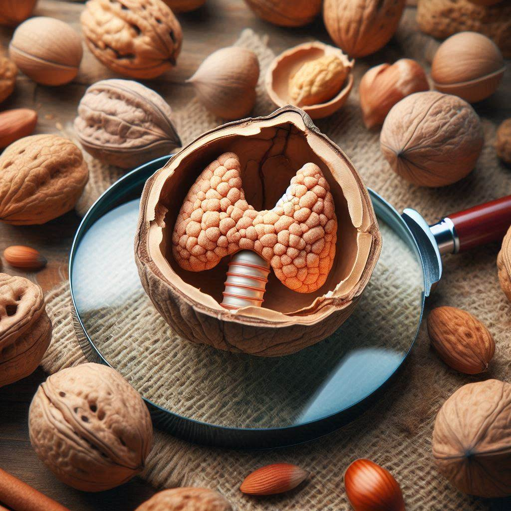

<div id="user-content-toc">
    <ul style="list-style: none;">
        <summary>
            <h1>NUTSHELL</h1>
        </summary>
    </ul>
</div>

<div align="left" style="text-indent: 0;">
    <h2>Machine learning streamlines the morphometric characterization and multi-class segmentation of nuclei in different follicular thyroid lesions: everything in a NUTSHELL</h2>
</div>

*Modern Pathology*

[Journal Link](https://www.sciencedirect.com/science/article/pii/S0893395224001881) | [Cite](#reference)

<!-- ## Abstract -->
The diagnostic assessment of thyroid nodules is hampered by the persistence of uncertainty in borderline cases, and further complicated by the inclusion of non-invasive follicular tumor with papillary-like nuclear features (NIFTP) as a less aggressive alternative to papillary thyroid carcinoma (PTC). In this setting, computational methods might facilitate the diagnostic process by unmasking key nuclear characteristics of NIFTPs. The main aims of this work were to (1) identify morphometric features of NIFTP and PTC that are interpretable for the human eye, and (2) develop a deep learning model for multi-class segmentation as a support tool to reduce diagnostic variability. Our findings confirmed that nuclei in NIFTP and PTC share multiple characteristics, setting them apart from hyperplastic nodules (HP). The morphometric analysis identified 15 features that can be translated into nuclear alterations readily understandable by pathologists, such as a remarkable inter-nuclear homogeneity for HP in contrast to a major complexity in the chromatin texture of NIFTP, and to the peculiar pattern of nuclear texture variability of PTC. A few NIFTP cases with available NGS data were also analyzed to initially explore the impact of RAS-related mutations on nuclear morphometry. Finally, a pixel-based deep learning model was trained and tested on whole slide images (WSIs) of NIFTP, PTC, and HP cases. The model, named NUTSHELL (NUclei from Thyroid tumors Segmentation to Highlight Encapsulated Low-malignant Lesions), successfully detected and classified the majority of nuclei in all WSIs’ tiles, showing comparable results with already well-established pathology nuclear scores. NUTSHELL provides an immediate overview of NIFTP areas and can be used to detect microfoci of PTC within extensive glandular samples or identify lymph node metastases. NUTSHELL can be run inside WSInfer with an easy rendering in QuPath, thus facilitating the democratization of digital pathology.

## Overview
This repository contains NUTSHELL (NUclei from Thyroid tumors Segmentation to Highlight Encapsulated Low-malignant lesions), a tool to reduce diagnostic variability in the assessment of thyroid nodules.

The goal is to support pathologists in identifying Non-Invasive Follicular Tumor with Papillary-like nuclear features (NIFTP) cases.

NUTSHELL is a pixel-based Convolutional Neural Network (CNN) model developed to identify and classify each cell nucleus in a Whole Slide Image (WSI) as belonging to one of three classes:
- NIFTP
- Hyperplastic nodule (HP)
- Papillary thyroid carcinoma (PTC)

The source code is available both for training and inference at the **tile** level.

The data that support the findings of this study are available from the corresponding author upon reasonable request.

NUTSHELL was developed in Python v3.11 using the PyTorch v2.2.0+cu121 framework.

> [!NOTE]
>The entire pipeline has been tested on a workstation equipped with an Intel Core i9-13900KF processor (32 threads, up to 5.80 GHz), 64 GB of memory and a Nvidia GeForce RTX 4090 graphics card, running Ubuntu 22.04 LTS.

<!-- ## Dataset generation
A total of 55 WSIs from 53 patients were collected. Only original slides used to render the primary diagnosis of the lesion were considered, no recuts were employed for the study. Only cases with histological diagnosis of HP, NIFTP or PTC were included in the study, and no additional histotypes (e.g. follicular adenoma/carcinoma) were part of the analysis.

Initially, the WSIs were processed with [QuPath](https://qupath.github.io/) v0.5.0 - an open source software for bioimage analysis - to annotate regions of interest (ROIs) by the pathologists, that is, areas within tissue samples containing pathological features.
To speed up the annotation process, the [QuPath StarDist extension](https://qupath.readthedocs.io/en/0.5/docs/deep/stardist.html) was adopted to segment nuclei within the ROIs. The results underwent rigorous examination by two experienced thyroid pathologists.
-->

### Morphometric analysis
[QuPath](https://qupath.github.io/) v0.5.0 - an open source software for bioimage analysis - was used to export **intensity** and **shape** nuclei **measurements** to generate a dataset of morphometric features within regions of interest (ROIs) identified by the pathologists, that is, areas within tissue samples containing pathological features.
In QuPath, the user can export the measurements in `Measure → Export measurements`.

The morphometric dataset included shape features (e.g. area, length, circularity, solidity, maximum and minimum diameters, perimeter), and intensity features computed on the optical density sum (OD Sum) color transform at the resolution of 1 μm/px (e.g. nuclear OD Sum mean value, Haralick texture features).

The _morphometric_analysis_ shell script reproduces the analysis in the _MorphometricAnalysis_ folder. The user can either use the path of the exported QuPath measurements file specified in the shell script or to modify it accordingly.
```
sh morphometric_analysis.sh
```
The full set of features was reduced by an unsupervised feature selection technique and finally subjected to both supervised (principal component analysis, PCA) and unsupervised (random forest, decision tree) machine learning methods in order to highlight differences among the "HP", "NIFTP" and "PTC" groups, provide insights into the feature importance, and enable the comparison with morphologic parameters readily understandable to the human eye.

An additional dataset containing only NIFTP nuclei was derived from the morphometric dataset and processed, with labels assigned to either known RAS-mutated cases or known WT (wild type) cases.

## Multi-class segmentation by NUTSHELL
Since the resolution of WSIs was in the order of tens of thousands of pixels, a tiling procedure was applied to obtain smaller images of a fixed size (512 x 512 pixels) suitable as input for NUTSHELL.

The Groovy scripts in the _QuPathScripts_ folder were used to generate the segmentation dataset.

Given a QuPath project containing WSIs with their respective annotated ROIs, the _thyroid_resection_labeled_tiles_exporter_ script generates a series of tiles overlapping the ROIs along with their respective labels at the pixel-level.
To do so, the user needs to specify an _output directory_, the _physical spacing_ – that is, the width of a tile’s pixel expressed in micrometers – in which extracting the tiles and their respective labels, the _size_ of the tiles, the desired _overlap_ between the tiles, and the _QuPath class names_ that are to be represented in the tiles.
In this work, all the WSIs were upsampled to the physical spacing of 0.25 μm/px.

In QuPath, the user can run a Groovy script at project level in `Script editor → Run for project`.

The  _split_ shell script reproduces the dataset partitioning.
```
sh split.sh
```
Below an example to generate 5 splits to perform a cross-validation procedure. The user is redirected to the `main` method of the _splitter_ Python script for a detailed description of all available command line arguments.
```
python splitter.py --pixel-size 0.25 --tile-size 512 --overlap 0 --qupath-class-names HP,NIFTP,PTC,Other --cross-validation 5
```

### Training
The _train_ shell script performs either the k-fold cross-validation procedure or the training on the entire training set.
```
sh train.sh
```
The _trainer_ Python script is used to train NUTSHELL on the dataset partitioning generated by the _split_ shell script, containing brightfield histology images of thyroid resections.
Below an example to run a 5-fold cross-validation, the remaining available command line arguments are described in the `main` method.
```
python trainer.py --device cuda:0 --batch-size 16 --workers 8 --epochs 100 --cross-validation 5 --early-stopping
```

### Inference
The _predict_ shell script performs inference on the test set and computes some quality indicators, among these the Intersection Over Union (IoU).
```
sh predict.sh
```
The _predictor_ Python script runs NUTSHELL in inference mode on the desired dataset partition (at the tile-level).
Below an example to run NUTSHELL on the test partition. The remaining available command line arguments are described in the `main` method.
```
python predictor.py --device cuda:0 --batch-size 8 --workers 4 --weights weights/model.pt --partition test
```

## Installation
The user can either create a new development environment executing the following command:
```
conda env create -f env.yaml
```
or update an existing one by executing the command:
```
conda env update -n NAMEOFYOUREXISTINGCONDAENV --file env.yaml
```
Then, activate it:
```
conda activate nutshell_OR_NAMEOFYOUREXISTINGCONDAENV
```

# Model inference at WSI level
The inference is also supported at the **WSI** level: the model predictions are converted into [GeoJson](https://geojson.org/) - an open standard to represent geographical features - files to be imported in QuPath.

Inside the _ReverseQuPath_ folder the user will find the source code to run inference with a pixel-based model.

The model must be in the [TorchScript](https://pytorch.org/docs/stable/jit.html) format.

Additionally, the user has to provide some essential model and task specific information required to run the model:
the _config_ JSON file in the _ReverseQuPath_ folder already contains the configuration necessary to run NUTSHELL. 

The _wsinfer_run_ Python script runs the inference on all the WSIs in the _WSIs_ folder.

The _qupath_ Python script creates an empty QuPath project, adds to the project the WSIs in the _WSIs_ folder, loads the GeoJson files generated by NUTSHELL, and imports them in the QuPath viewer by coloring the nuclei in :green_circle:`#00ff00` (HP), :large_blue_circle:`#0000ff` (NIFTP) and :red_circle:`#ff0000` (PTC).

The shell script _colorizer.sh_ in the _ReverseQuPath_ folder automates the previous steps regarding the execution of the pixel-based model and the rendering in QuPath at the WSI level.
```
cd ReverseQuPath
sh colorizer.sh
```
The user is expected to double-check the file paths in the shell script and to modify accordingly.

> [!NOTE]
> This last step may fail if there is not enough memory available!
> 
> Should this be the case, QuPath can be instructed to do fewer tasks in parallel by reducing the number of processors for parallel commands.
> To do so, the following lines have to be modified at the end of the QuPath.cfg file.
> 
> (On our machine the QuPath.cfg file is located at /opt/QuPath/lib/app.)
 
> java-options=-XX:MaxRAMPercentage=NEWPERCENTAGE
> 
> java-options=-Djava.util.concurrent.ForkJoinPool.common.parallelism=NEWNUMBEROFTHREADS

> [!NOTE]
> The Python PAQUO library tries to find the QuPath installation path: if it fails, the path can be specified by editing the _wsi_run_ Python script.

## Limitations
The application of the model on out-of-distribution data can lead to poor performance.

NUTSHELL is intended for research purposes only.

## Issues
- The preferred mode of communication is via GitHub issues.
- If GitHub issues are inappropriate, email v.coelho@campus.unimib.it (and cc vincenzo.limperio@unimib.it).
- Immediate response to minor issues may not be available.

## License
Academic Free License v3.0.

## Acknowledgements
This project was built on top of amazing repositories such as [wsinfer](https://github.com/SBU-BMI/wsinfer) (used for model inference) and [qupath](https://github.com/qupath/qupath) (dataset generation and prediction visualization). We thank the authors and developers for their contribution!

## Reference
If you find our work useful, please consider citing:

> V. L’Imperio, V. Coelho, G. Cazzaniga, et al. Machine learning streamlines the morphometric characterization and multi-class segmentation of nuclei in different follicular thyroid lesions: everything in a NUTSHELL. Modern Pathology (2024). https://doi.org/10.1016/j.modpat.2024.100608

```bibtex
@article{LIMPERIO2024100608,
    title = {Machine learning streamlines the morphometric characterization and multi-class segmentation of nuclei in different follicular thyroid lesions: everything in a NUTSHELL},
    author = {Vincenzo L’Imperio and Vasco Coelho and Giorgio Cazzaniga and Daniele M. Papetti and Fabio {Del Carro} and Giulia Capitoli and Mario Marino and Joranda Ceku and Nicola Fusco and Mariia Ivanova and Andrea Gianatti and Marco S. Nobile and Stefania Galimberti and Daniela Besozzi and Fabio Pagni},
    journal = {Modern Pathology},
    pages = {100608},
    year = {2024},
}
```